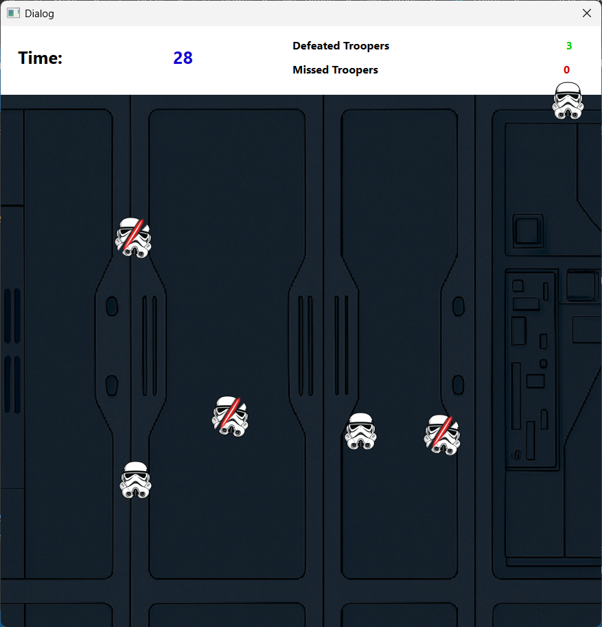

# 🌌 Qt Stormtrooper Reflex Game

A simple reflex-based desktop game developed using **C++** and **Qt Widgets**.  
Click on troopers as they appear to defeat them before they vanish. The goal:  
score as high as possible within 30 seconds.

---

## 🎮 Gameplay Overview

- Troopers appear at random positions.
- Click them quickly to defeat them.
- Each defeated trooper plays a lightsaber sound.
- Troopers disappear after 2 seconds if not clicked.
- Missed troopers are tracked.
- Final score and missed count are shown at the end.
- Player enters their name before the game starts.
- Scores are saved to `skorlar.txt`.

---

## 🧩 Technologies Used

- **C++ / Qt 5.x**
- Qt Widgets
- QSoundEffect (for audio feedback)
- QFile / QTextStream (for score saving)

---

## 📷 Screenshots

<p align="center">
  
</p>

---

## 🚀 How to Run

1. Open the `.pro` file in **Qt Creator**
2. Build and run the project
3. Enter your name to begin

---

## 📁 Project Structure

```
main.cpp
dialog.h / dialog.cpp
trooper.h / trooper.cpp
homedialog.h / homedialog.cpp / homedialog.ui
resources/
 ├── images/
 │    ├── 3.png (normal trooper)
 │    └── 4.png (defeated trooper)
 └── sounds/
      └── clash.wav
skorlar.txt
README.md
```

---

## 📌 Notes

- Created as part of a university-level assignment
- All media assets are used for educational/non-commercial purposes

---
